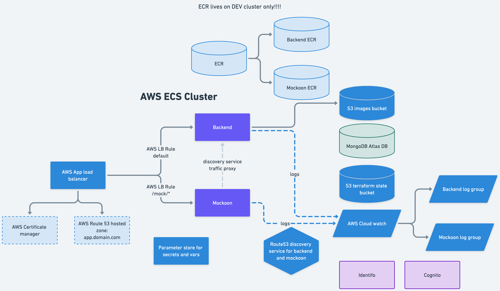

# Reference Cloud infrastructure (IaC)

This repository declares infrastructure of Gigit cloud as a code using [Terraform](https://www.terraform.io/).

## TODO

TODO
 - [ ] connect prod to dev ECR https://aws.amazon.com/blogs/containers/sharing-amazon-ecr-repositories-with-multiple-accounts-using-aws-organizations/
 - [ ] setup code pipeline to deploy to ECS https://docs.aws.amazon.com/codepipeline/latest/userguide/tutorials-ecs-ecr-codedeploy.html


## Dependencies

- Terraform v1.2.6
- AWS credentials for accessing Terraform state (hosted in S3 bucket)
- gomplate, use your local dependency management system for it, for mac: `brew install gomplate`
- GNU Make (should be part of any system by default). Optional, you can run command from makefile directly in terminal.


1. Copy two file to your root repo location:

```bash
    curl https://raw.githubusercontent.com/MadAppGang/architecture/main/project/Makefile -o Makefile
    curl https://raw.githubusercontent.com/MadAppGang/architecture/main/project/dev.yaml -o dev.yaml
```

2. Init new data:
   
```bash
    make init
```
   

3. Edit `dev.yaml` file and run generate your terraform data:

```bash
    make dev
```

or 

```sh
    gomplate -c vars=dev.yaml -f ./architecture/env/main.tmpl   -o ./env/dev/main.tf
```

If you set up on a new AWS account, you need to create state bucket first:

```bash
export AWS_PROFILE=projectdev
aws s3 mb s3://instagram-terraform-state-dev
```

4. Init Terraform:

Wnsure uou are using the proper AWS_PROFILE first.

```bash
    export AWS_PROFILE=projectdev
    make devplan
```

or

```sh
    cd env/dev
    terraform init
```

5. Apply the plan when you're happy with it:


```bash
    make devapply
```

or

```bash
    terraform apply
```

## Makefile commands

| command | description |
| ---- | ------ |
| clean | remove all the data |
| update | apply new version of architecture |
| version | show current architecture version |
| dev | generate dev terraform env |
| prod | generate prod terraform env |
| devplan | show dev terraform plan |
| prodplan | show prod terraform plan |
| devapply | apply dev terraform plan | 
| prodapply | apply prod terraform plan |

## Env variables management
Backend, and every task are using env variables from AWS Parameter Store (SMM). One parameter store per value.

When you need to populate initial values from JSON file, please use 


## Architecture




## Health check

All services by default should respond status `200` on GET handler with path `/health/love`. If it is not responding with status 200, the application load balancer will consider the service unhealthy and redeploy it. 


## Remote dubug

[You can use Amazon ECS Exec](https://docs.aws.amazon.com/AmazonECS/latest/developerguide/ecs-exec.html) to  execute command remotely in terminal.

To do so, you need to install [AWS Session Management Plugin](https://docs.aws.amazon.com/systems-manager/latest/userguide/session-manager-working-with-install-plugin.html#install-plugin-macos) on your machine.

For mac Mx you  need:

```shell
curl "https://s3.amazonaws.com/session-manager-downloads/plugin/latest/mac_arm64/session-manager-plugin.pkg" -o "session-manager-plugin.pkg"
sudo installer -pkg session-manager-plugin.pkg -target /
sudo ln -s /usr/local/sessionmanagerplugin/bin/session-manager-plugin /usr/local/bin/session-manager-plugin

```

After that you can verify the installation: `session-manager-plugin`.

With session manager you can login to container, execut a command in container or do a port forwarding.

You can use a [usefull script](https://github.com/aws-containers/amazon-ecs-exec-checker) to help you work with AWS Exec.


